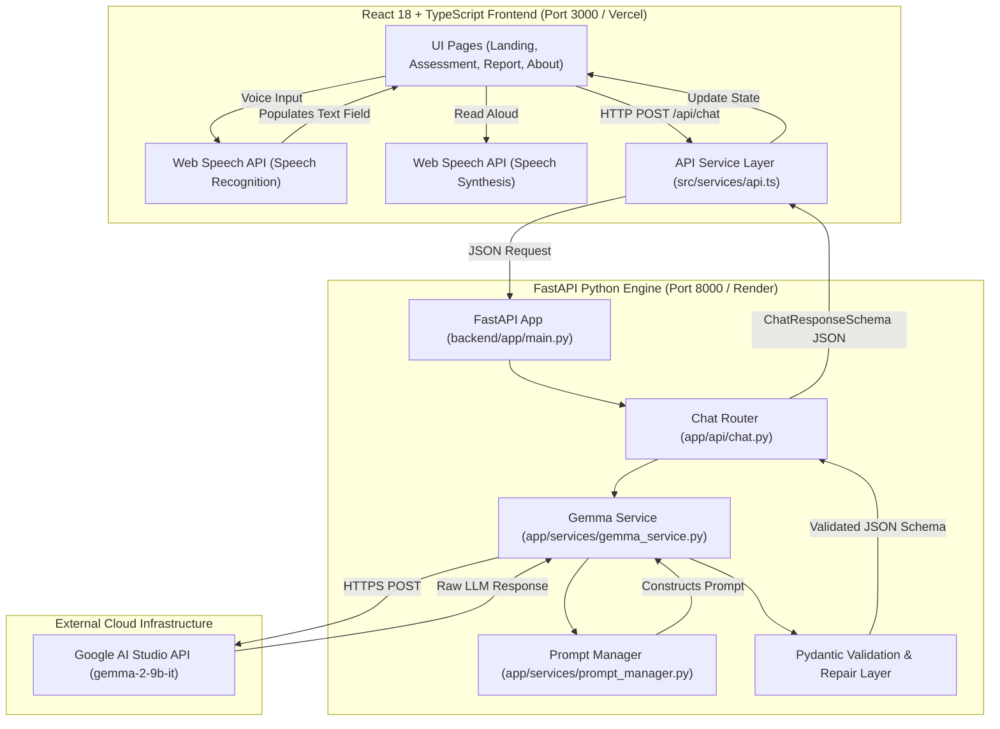

# System Architecture - Sanjeevani AI

> **Technical Architecture Specification for Sanjeevani AI (Build with Gemma Hackathon Edition)**

---

## 1. Executive Summary & Architecture Paradigm

**Sanjeevani AI** follows a strictly **decoupled architecture**. The presentation and interaction layer (React 18 + TypeScript frontend) contains zero medical logic or decision trees. All symptom extraction, urgency classification, clinical follow-up question generation, and emergency guardrail evaluations are performed by a Python FastAPI backend engine powered by Google Gemma (`gemma-2-9b-it`).

---

## 2. High-Level Data Flow & Mermaid Diagram



---

## 3. Frontend Architecture

The frontend is constructed using Vite, React 18, and TypeScript. It is designed for maximum accessibility, responsiveness, and performance.

### Key Components & Responsibilities

1. **[`src/App.tsx`](file:///d:/FIFA/src/App.tsx)**:
   - Configures Client-Side SPA routing via `react-router-dom` (`BrowserRouter`, `Routes`, `Route`).
   - Routes: `/` (Landing Page), `/assessment` (Health Assessment Chat), `/report` (Printable Brief), `/about` (Mission & Tech).

2. **[`src/services/api.ts`](file:///d:/FIFA/src/services/api.ts)**:
   - Centralized REST API client layer.
   - Communicates with the FastAPI backend using `fetch()`.
   - Base URL defaults to `import.meta.env.VITE_API_BASE_URL` or fallback `https://sanjeeveni.onrender.com/api`.
   - Provides async methods: `startAssessment()`, `sendMessage()`, `generateReport()`, `clearSession()`, `getLanguages()`.
   - Includes graceful client-side fallback objects if the network or backend is unreachable.

3. **[`src/services/speechService.ts`](file:///d:/FIFA/src/services/speechService.ts)**:
   - Encapsulates native Web Speech API interactions.
   - **Speech-to-Text (STT)**: Instantiates `SpeechRecognition` or `webkitSpeechRecognition`, sets target BCP-47 language codes (e.g. `hi-IN`, `es-ES`, `en-US`), handles interim/final results, and populates the chat input field.
   - **Text-to-Speech (TTS)**: Uses `window.speechSynthesis` to speak assistant messages. Strips emojis and markdown symbols prior to playback for clean audio output.

4. **UI Design System**:
   - Styling defined in [`src/index.css`](file:///d:/FIFA/src/index.css) and [`tailwind.config.js`](file:///d:/FIFA/tailwind.config.js).
   - Theme palette: Primary `#2563EB` (Royal Blue) and Secondary `#06B6D4` (Teal).
   - Glassmorphism: `backdrop-blur-md bg-white/75 border border-white/60`, 20px rounded cards (`rounded-card`), custom subtle scrollbars.

---

## 4. Backend Architecture

The backend is built with Python 3.10+, FastAPI, and Pydantic. It operates as the clinical decision and reasoning engine.

### Key Modules & Responsibilities

1. **[`backend/app/main.py`](file:///d:/FIFA/backend/app/main.py)**:
   - Initializes `FastAPI` instance.
   - Configures wildcard `CORSMiddleware` (`allow_origins=["*"]`) for cross-domain requests between Vercel and Render.
   - Mounts API routers (`chat`, `report`, `hospital`).
   - Defines root `@app.get("/")` status handler and `@app.get("/health")` check.

2. **[`backend/app/models/schemas.py`](file:///d:/FIFA/backend/app/models/schemas.py)**:
   - Pydantic models for strict data validation:
     - `UrgencyLevelEnum`: `'Low' | 'Moderate' | 'High' | 'Emergency'`
     - `HealthSummarySchema`: `symptoms`, `duration`, `urgency`, `recommendation`, `confidence`, `emergency`
     - `ChatRequestSchema`: `sessionId`, `text`, `languageCode`, `history`, `summary`
     - `ChatResponseSchema`: `assistantMessage`, `healthSummary`, `followUpQuestions`, `thoughtProcess`
     - `ReportRequest` & `ReportResponse`
     - `HospitalSearchResponse`

3. **[`backend/app/services/gemma_service.py`](file:///d:/FIFA/backend/app/services/gemma_service.py)**:
   - Handles async HTTP communication (`httpx`) with Google AI Studio API (`/v1beta/models/gemma-2-9b-it:generateContent`).
   - Extracts JSON blocks using regex.
   - Validates response objects against `ChatResponseSchema`.
   - Executes auto-repair retry loops if output JSON formatting requires correction.
   - Applies emergency safety guardrails.

4. **[`backend/app/services/prompt_manager.py`](file:///d:/FIFA/backend/app/services/prompt_manager.py)**:
   - Manages system prompt templates for Google Gemma.
   - Enforces clinical boundaries: **No diagnoses, no prescriptions, triage only**.
   - Directs Gemma to evaluate history, ask targeted follow-up questions, classify urgency, and respond in the patient's language.

---

## 5. Structured JSON Contract

All AI triage responses follow an exact JSON schema:

```json
{
  "assistantMessage": "Conversational assistant reply to patient in native language",
  "healthSummary": {
    "symptoms": ["Symptom 1", "Symptom 2"],
    "duration": "Reported duration (e.g. '2 days') or 'Unspecified'",
    "urgency": "Low | Moderate | High | Emergency",
    "recommendation": "Next step care recommendation",
    "confidence": 92.5,
    "emergency": false
  },
  "followUpQuestions": ["Follow-up question 1", "Follow-up question 2"]
}
```

---

## 6. Emergency Red-Flag Interceptor Pipeline

```
Patient Query Input
        │
        ▼
GemmaService._check_emergency_red_flags()
        │
        ├── Contains ["chest pain", "cannot breathe", "unconscious", "seizure", "heavy bleeding", ...]
        │         │
        │         YES ──► Overrides Payload:
        │                  - emergency: true
        │                  - urgency: "Emergency"
        │                  - assistantMessage: "⚠️ EMERGENCY NOTICE: Immediate care required. Call 911 / 108."
        │
        └── NO ──► Proceed to Google Gemma LLM Inference
```

---

## 7. Deployment Architecture

- **Frontend**: Deployed on **Vercel** with single-page app route rewrites configured in [`vercel.json`](file:///d:/FIFA/vercel.json).
- **Backend**: Deployed on **Render** using top-level [`main.py`](file:///d:/FIFA/main.py), [`requirements.txt`](file:///d:/FIFA/requirements.txt), [`Procfile`](file:///d:/FIFA/Procfile), and [`backend/render.yaml`](file:///d:/FIFA/backend/render.yaml).
